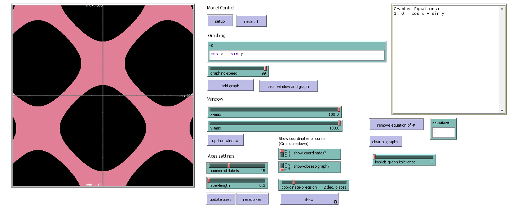
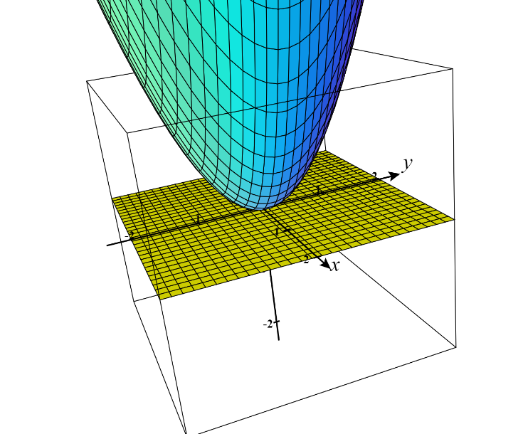
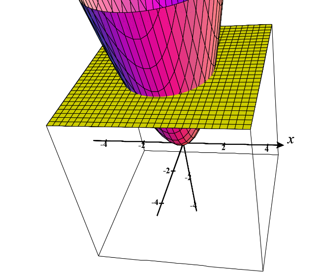
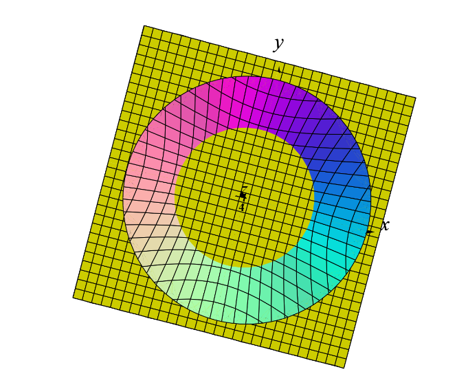
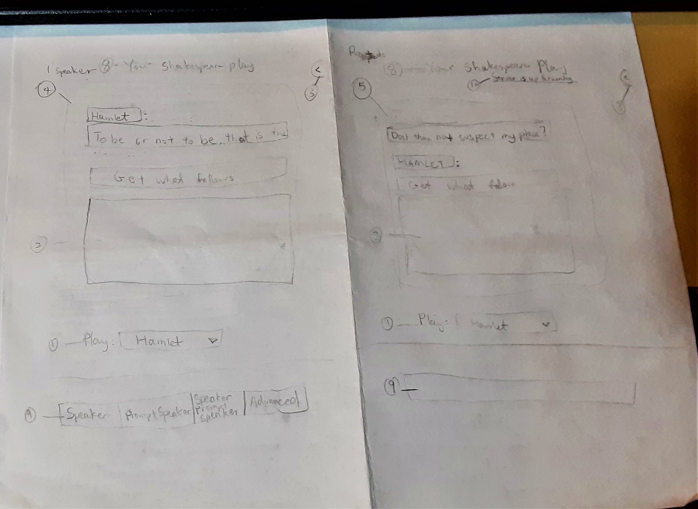
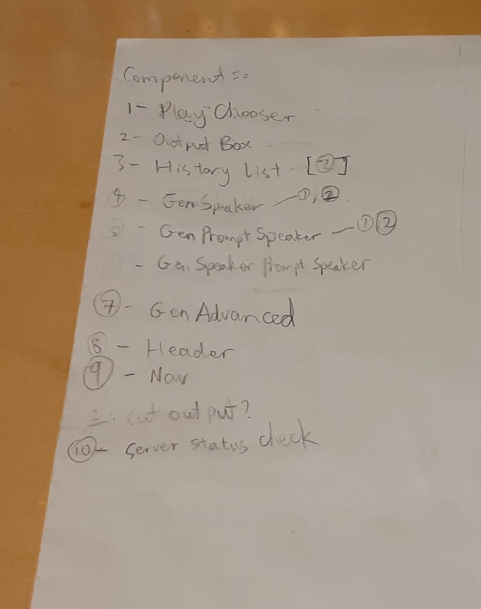

# Project 1: Grapher

https://github.com/ruoshui-git/grapher/blob/main/grapher.nlogo

`grapher` is my graphing calculator, written in NetLogo.

# What is NetLogo?

NetLogo is a "multi-agent programmable modeling environment", in which commands are entered to control "observer" and 3 other agent-sets (turtles, patches, links) to run a simulation and draw graphics on screen.

# Motivation

When I took Intro CS, I had some previous experience, so I asked my teacher Mr. Brooks if there's something interesting that I could do.

## Initial Idea

In a NetLogo program:

1. Draw the grid and axis for a Cartesian (xy) plane.
2. Have a 2 sliders, each controlling 1 coefficient of a parabola.
3. Have a turtle draw the graph and change the sliders while drawing, and see what interesting images can come out in the end.

## What I did

I offered to write a NetLogo program that can graph arbitrary functions. I wanted to see what's possible with the limited string parsing abilities of NetLogo.

# Process

## Building Function Grapher

As it turned out, I didn't need any string parsing. NetLogo allows for `eval`uating NetLogo expressions. I have the user enter the equation of the graph as an expression, and prepend `[x] ->` to make that an `anonymous reporter` (aka an anonymous `function`) with the argument `x`, and just run it repeatedly from the left to right, supplying the `x` value and setting the return value as `y`, and them plotting `(x, y)` on the screen, and connecting 2 adjacent dots with a straight line. When I make the interval of `x` small enough, the graph looks pretty good. (But it does make discontinuous functions look weird.)


--_My initial funtion grapher._

It was relatively easy compared to what came later.

## Building Implicit Equation Grapher

Then I started to wonder if it's possible to graph arbitrary implicit equations. It's the same as a "relation," which allows for multiple `y` for each `x`.

### Initial Idea

At first, along with some other math teachers, Mr. Brooks said it looked like we have to use gradient fields (or something like that, I can't remember). I didn't know what it was, so according to him, all I had to do was to "learn some calculus". The idea was to find a point on the graph, and then calculate in which direction the graph would "move", and have a turtle follow that path and draw on it.

The problem with this approach is that many graphs are not continuous. Some can have multiple parts, or multiple "pathes" like the following graph, and the algorithm wouldn't know which path to follow. It can follow every path, but then where should it end drawing?


--_Graph of `sin(x) = cos(y)`, which poses a problem to the "following path" idea._

### My implementation

Before doing anything more, I needed to refactor some code. Now I require an expression that has both `x` and `y` in it.

And instead of prepending `[x] ->` to the expression from the user, now I prepend `[x y] ->` so together they make up the input.

Not understanding the algorithm anyway, my first desperate attempt (over winter break) was to assign a `(x, y)` to each each patch (pixel) according to their location on the screen. For each patch, calculate if their `(x, y)` fit in the equation (`= 0`). If it does, then the point is on the graph.

But an exact equal comparison produces almost nothing. It's almost never exact, because the details that can be represented by `patches` are finite. So an approximation is needed. The `epsilon` (or what Mr. Brooks called `tolerance`), is defined via a user-controlled slider.


--_Implicit graph with a `tolerance` of 1._
<br><br><br>

--_Implicit graph with a `tolerance` of 10._

The problem here is that different graphes need different `tolerance`s. Sometimes even different parts of a graph need different `tolerance`s, as shown by the two images above. Both are supposed to be curves/lines with the same thickness.

And we thought that nothing could be done to improve this, for a while.

### My Thought Journey

(Images included here, apart from my own program, are taken from CalcPlot3D and Desmos. I didn't think to use them originally when I was thinking about these. But they're included here to demonstrate what I'm talking about.)

After winter break, Mr. Brooks told me that what I was doing was taking a cross section of the 3D graph with the plane `z = 0`. My equations were in the form of `0 = [equation]`. If I were to use another number on the left hand side, it would give me the cross section at a different height.

I thought he meant that there was something wrong about it. I thought about that for a long time.

So do they all make sense together? Here's what I thought about over the next few days:

If I were to graph `z = x^2 + y^2`, it would look like a cone that opens upward, except for the the body is round. From the side, it should look like a parabola (since as `z` increases, `y` increases on the order of squares).



--_`z = x^2 + y^2` intersecting `z=0`._

If I slice the graph with `z = 0`, I get a dot, because that's the tip of the 3D shape. As `z` increases, the plane will intersect thicker parts of the 3D shape, producing larger circles.



--_`z = x^2 + y^2` intersecting `z=4`._

And this makes sense when I interpret the process as increasing the radius of a 2D circle (`r^2 = x^2 + y^2`).



--_`z = x^2 + y^2` intersecting `z=4`, viewing from the top. It's easier to see here that the cross section is a larger circle._

Furthermore, the 3D shape here is only above or on `z = 0`, so if I move the plane down (where `z < 0`), I would see nothing because the plane and the 3D shape wouldn't intersect. It works with the circle definition because a circle with `r < 0` will not produce any graph.

So I thought that they are coherent. I then talked to Mr. Brooks about this. He said there was nothing wrong with it. It's just the way that I was implementing graphing reminded him of that slicing process.

Then the graphing problem here becomes, how do we know if a point is at the intersection of the plane `z = 0` and the 3D shape?

Just as I was going to leave the office on that day, he realized that if a point on the 3D shape intersects with the plane `z = 0`, then there should be points both above and below the plane around it.


--_Graph of `z = 2 - x^2 - y^3`. Notice that for a point to be at the boundary, some neighbors have to be above `z = 0`, some below._


--_Graph of `0 = 2 - x^2 - y^3`; The cross section of `z = 2 - x^2 - y^3` at `z = 0`._

This means, in NetLogo, if we compute `z` for every `patch` and compare with `z` of the neighboring `patches`, we can know if the point is on the graph.

### New Implementation

The actual implementation first computes a `z` for all `patches` from their assigned `(x, y)`. Then it checks if the `z` value of the current `patch` is above the plane. If it is, and any neighboring `patch` is below the plane, then we can say that the current `patch` is "on the graph". Other cases don't need to be checked, because we end up with a duplicate point that way.

With that, here's my viable product:


--_Graph of `sin(xy) = cos(xy)`._

The algorithm was really difficult to come up with. But the implementation was _really_ easy. Here's the implementation of the core algorithm:

```netlogo
; graph the given equation: equation (as anonymous reporter)
to graph-implicit [ equation ]
  ;; reset patches state
  ask patches
  [
    set on-graph? false
  ]

  ;; compute and store height to the surface
  ask patches
  [
    carefully
  [
      set wzcor (runresult equation wxcor wycor)
    ]
    [
        ;; ... error catching code omitted
    ]
  ]

  ;; graph all valid patches
  ask patches with [wzcor != false]
  [
    ifelse wzcor = 0
    [ set on-graph? true]
    [
      if wzcor > 0
      [
        if any? neighbors with [ wzcor != false and wzcor < 0 ]
        [ set on-graph? true ]
      ]
    ]
  ]

  ask patches with [on-graph?]
  [ set pcolor graph-color ]

end
```

And I added other features, such as resizing and panning the window, changing colors, etc, which are relatively easy to reason about, but involves much more coding.

# Known Bugs

NetLogo limitations exist. But those aren't interesting.

Here's an interesting one: in junior year Calculus class, we talked about a weird equation:

`x^3 + y^3 + 1 - 3xy = 0`

This graph has a single point at `(1, 1)` and a line running below it. Only at `(1, 1)` the graph is on the cross section. All points around it are above the plane, no points are below.


--_Graph of `x^3 + y^3 + 1 - 3xy = z`. The shape "kisses the plane" `z = 0` at `(1, 1)`._

Turns out that even Desmos cannot graph that dot accurately:


--_Graph of `x^3 + y^3 + 1 - 3xy = 0`. There should be a point at `(1, 1)`, but it's not graphed._

And my calculator, on default settings, just happens to check `(1, 1)`, so it actually graphed that point.


--_Graph of `x^3 + y^3 + 1 - 3xy = 0` in my calculator. Do you see that dot?_

A transformed version, (e.g. via translation), however, will not show correctly. But since even Desmos can't do this, I'm good with what I have now.

# Ideas for Improvement

- Cache the computation results and reuse them in future computation.
- Show different graphs with different colors, like Desmos.
- NetLogo Web still a work in progress, and slower compared to the desktop version. Contribute to it by porting the CoffeeScript engine to WebAssembly compiled from Rust.

# More

Just as I was finishing up this writeup, I found a new problem. My current algorithm ignores cases where the two parts of the 3D shape switch over from one side of the `z = 0` plane to the other, without intersecting the plane at all.


--_Graph of `z = 1 / (x + y)`._

This should not produce any graph, but it showed up in my calculator where the boundary-switch happened.


--_Graph of `0 = 1 / (x + y)` in my calculator. The slant line is caused by the shift in the sign of the `z` values, but the graph never crosses `z=0`._

But desmos handles it correctly:


--_Nothing is shown on the screen, because the equation doesn't produce a graph._

But now, maybe I can take into account how the graph is behaving near the boundary (going towards infinity vs 0) to determine if it's a legitimate boundary crossing or a weird teleportation.

---

# Project 2: Shakespeare

This project is an app that generates Shakespeare lines from any chosen play, with the GPT-2 AI model.

App: https://shakespeare-gpt2.netlify.app/

Note: the backend is hosted on Azure Web App, using a plan that consumes credit, which may run out after March or so.

# Shoutouts!

To:

- Google Colab for free GPU
- _aitextgen_ for training my model in Colab
- _FastAPI_ for fast API endpoint development
- _Svelte_ for frontend
- Folger Shakespeare Library for the play texts and website font
- Azure Web Apps for backend hosting && providing student credit via GitHub Student Pack
- Netlify for frontend hosting

# Motivation

This was originally done for my senior English class after we read _Hamlet_. Initially I wanted to do a computational literary analysis on _Hamlet_, but a conversation with (again!) Mr. Brooks led me to do something related with AI.

Another reason I chose to do this was that most people might know about text generation with AI, but they might not have the knowledge to set one up. This would allow them to explore some modern AI.

# Background

GPT-2 is a nueral network model for text generation, published by OpenAI. It produces text with human-like quality even with the small version of the model. Larger versions give better results, but require greater computational power and disk space.

This is my first time building anything related to AI.

# Process

First, I trained GPT-2 in Colab with _gpt-2-simple_. I got very excited about it producing results.

My goal: deploy everything with 0 cost. I knew that Netlify is free if I can do everything in the browser.

## Trying to build AI into a browser app

So I wanted to deploy GPT-2 entirely in the browser. I looked up and tried many ways, all of them failed.

Things I tried:

- Convert TensorFlow1 model to Keras and then loading it in tfjs. Eventually got an error:

```
could not load model: Error: Unknown layer: EmbeddingRet. This may be due to one of the following reasons:
1. The layer is defined in Python, in which case it needs to be ported to TensorFlow.js or your JavaScript code.
2. The custom layer is defined in JavaScript, but is not registered properly with tf.serialization.registerClass().
```

- Train Huggingface Transformer...
  - Didn't know how to properly make a dataset
  - Didn't know how to use top-k sampling in the Huggingface pipeline, with the pytorch model (Didin't try TF2 model)
    - So I got worse results than my first attempt with TF1 using gpt2-simple
- Convert TF1 model into PyTorch
  - No "constants" file in pytorch_model.bin (tch-rs couldn't load it)
- Convert TF1 to mmdn IR (and eventually PyTorch)
  - Didn't know the output node name
- Save original fine-tuned GPT-2 into Keras
  - https://github.com/CyberZHG/keras-gpt-2
  - Couldn't load in TFJS
- Trying to load from sonos/tract
  - Feature incomplete: "stateless evaluation not implemented"

I also wanted to compile the program with _rust-bert_ into WebAssembly, but it needs linking to C++. Linking these libraries is probably unsupported in WebAssembly, so this would be hard/impossible.

In the end, I decided to deploy the AI model on a server, expose an API, and build an intuitive user interface to interact with it.

## Training GPT-2

I chose to use `aitextgen` for training. Colab gives valuable free GPU resource.

I downloaded and formatted all the plays from the Folger Shakespeare Library, and trained a GPT-2 model on it.

For formatting, Initially I just stripped out the Folger specific text, and combined all the plays together.

But most of the generated text had speakers from different plays mixed up:

```
HORATIO:

LUCIO:

BARNARDO:
What is the matter?

HORATIO:

BARNARDO:
Look, my lord, your head almost approaches your shoulders.

HORATIO:
My lord!

BARNARDO:
How say you?

HORATIO:
As if my head were lodged in one part richly
and finely ring'd, and thy upper arm, richly ring'd,
rose without thy lower arm: the conclusion is drawn.

...
```

And this made it impossible for me to control which play the text generation is based on. Undesirable.

There's a `tinyshakespeare` dataset published, but the problem there was even worse. And it doesn't have _Hamlet_.

Reading the training process for GPT-2 poetry generation https://gwern.net/gpt-2, gave me an idea: prefixing a play-specific number to each line of the text:

_Hamlet_:

```
...

6|HORATIO:
6|'Tis here.
6|[Ghost exits.]
6|
6|MARCELLUS:
6|'Tis gone.
6|We do it wrong, being so majestical,
6|To offer it the show of violence,
6|For it is as the air, invulnerable,
6|And our vain blows malicious mockery.
6|
6|BARNARDO:
6|It was about to speak when the cock crew.
6|
6|HORATIO:
6|And then it started like a guilty thing
6|Upon a fearful summons. I have heard

...
```

_Much Ado About Nothing_:

```
20|Much Ado About Nothing
20|by William Shakespeare
20|
20|[Enter Leonato, Governor of Messina, Hero his daughter,
20|and Beatrice his niece, with a Messenger.]
20|
20|
20|LEONATO:
20| [with a letter]  I learn in this letter that Don
20|Pedro of Aragon comes this night to Messina.
20|
20|MESSENGER:
20|He is very near by this. He was not three
20|leagues off when I left him.

...
```

This did produce the desired results:

- Context mostly confined to a play
- Characters confined to a play

For presentation, stripping the number in the front is an easy process.

Other than prefixing, my Python script also did these:

- Strip out section headers like "ACT 5", "===", etc
- Append "<|endoftext|>" after each play
- Combine all the plays into a single text file
- Transform speaker name line, like this:

Before:

```
HORATIO 'Tis here.
[Ghost exits.]

MARCELLUS 'Tis gone.
```

After

```
HORATIO:
'Tis here.
[Ghost exits.]

MARCELLUS:
'Tis gone.
```

This allows user to prompt the model to generate dialogue for a specific speaker, or give words to be a speaker in the prompt. (Check my app if you're not sure what this means.)

See my [text formatting repo](https://github.com/ruoshui-git/shakespeare-data) for code.

## Building and Deploying Backend

Building API in Python with FastAPI was quick.

Deploying the backend was painful. The trained model is ~500 MB, ~1GB with all the supporting libraries.

I tried Heroku. Disk space wasn't enough, and I had no money to upgrade. I tried to downloading the model from my Google Drive on startup, but that always timed out.

I tried Azure Web Apps. I tried uploading files directly, deploying through Azure Pipelines, but none worked. Checking the logs showed me that it's some Docker failure.

I almost thought that this was impossible. But Docker seemed to be the last bit of hope, after looking at other deployment options.

I've never used Docker. But I decided to try it out.

Windows Subsystem for Linux 2 just came out, Docker supported that. So I installed both.

I learned some basic Docker and got my FastAPI server running locally.

Then I deployed this on Azure Web Apps for Containers. It still didn't work initially. Checking logs told me that Docker timed out when starting.

In the end, I confirmed on my own computer that the RAM is too low on the server. I upgraded the plan with my Azure credit and everything worked!

<br>

Backend & API Docs: https://shakespeare-backend.azurewebsites.net/docs

Backend Repo: https://shakespeare-backend.azurewebsites.net/docs

## Building and Deploying Frontend

After refreshing myself on Svelte, I tried coding the website. It got too slow to do things without a plan. (What I always did with websites.)

So I tried something new: I drew out what I wanted my program to look like on paper, and identified the components that I needed.



--_Sketch of components._



--_List of components._

Then I coded the components from "bottom-up": build smaller ones first, and then test it, and then build larger components that need the smaller ones, and then test the larger...

After that, I styled the pages to make the app look better, and made sure that the webpage look nice on different screen sizes.

I knew that one problem with Svelte's default toolchain is that it doesn't add a hash to the output JavaScript and CSS files, which when deployed to the web, may cause the browsers to load only the outdated version, when a new version is published.

In my opinion, if I didn't encounter all the difficulties with converting and deploying AI models, styling websites was the _hardest_ task.

There seemed to be no guide on the internet for doing this, so I figured out my own way of doing it by changing the template's default Rollup build options (a build system for Node.js).

I built, commited, and deployed it on Netlify.

## Done!

Well, I still added more features to the site and made the user experience better. For example, I later added:

- "advanced mode" to leave the prefixes alone instead of stripping them away, and the ability to control more text generation settings
- "Example" button to randomly show a pre-made examples
- an About page
- ability to store results in LocalStorage so they will stay there the next time user returns to the app
- a message to warn users that text generation takes a long time

---

Overall, this was a big learning journey for me.

# Using the App

Try it out yourself!

https://shakespeare-gpt2.netlify.app

Enjoy some of my samples:

```
Now cracks a noble heart. Good night, sweet prince,
And flights of angels sing thee to thy rest.
[March within.]
Why does the drum come hither?

[Enter Fortinbras with the English Ambassadors with
Drum, Colors, and Attendants.]


FORTINBRAS:
Where is this sight?

HORATIO:
What is it you do?

FORTINBRAS:
This is mightiest balm,
Which spongy April never saw.

HORATIO:
O mightiest love!
If thou couldst, whatshows and what forms,
Didst thou see?

FORTINBRAS:
Have with you, my lord.

HORATIO:
What are
```

```
To be or not to be--that is the question:
Whether 'twas wisdom, folly, fear,
Pride, dislike, mutability,
Love's own worst, affliction's edge,
The strangeness of his age, his ebbs and flows,
Sprook and chiding, censure, and reverence,
To use and converse with dreams and dreams,
Abuse and flout--yea, to the very brink--
And then to England, Wales, and, you know,
As doubtful whether what I am, so doubtful,
As if the thing I see be not what I see,
And so am nothing.

KING:
Too doubtful, too doubtful.

POLONIUS:
I think not so, my lord.

KING:
We doubt it nothing.

POLONIUS:
```

```
OPHELIA:
It appeareth nothing to me
but a foul and pestilent congregation of vapors.
What a piece of work is a man, how noble in
reason, how infinite in faculties, in form and moving
how express and admirable; in action how like
an angel, in apprehension how like a god: the
beauty of the world, the paragon of animals--and the
beauty of the world, the paragon of animals--and
yet all these are excused. Wherefore do you look
on me? What would you have me be, an I
you?

OPHELIA:
You should have given me your picture,
for the world, I have been the boy.

OPHELIA:
I would not have you believe my father,
Nor feel myself so keen in needle-holes.
I will be just, your son, and do the rarest
```

```
OPHELIA:
What a piece of work is a man, how noble in
reason, how infinite in faculties, in worth,
and in the shape of people, hath cause to commend
it himself.

POLONIUS:
Give me leave to mark him.

OPHELIA:
[sings]
	How should I your true love know
	   From another one?
	By his cockle hat and staff
	   And his sandal shoon.

POLONIUS:
Pray you, one of you question yond man, if he
for gold will give us any food. I faint almost to death.

OPHELIA:
Nay, do not scorn me, my lord. They contempt me
too, but I care for my manor. Shall I not die?
```
